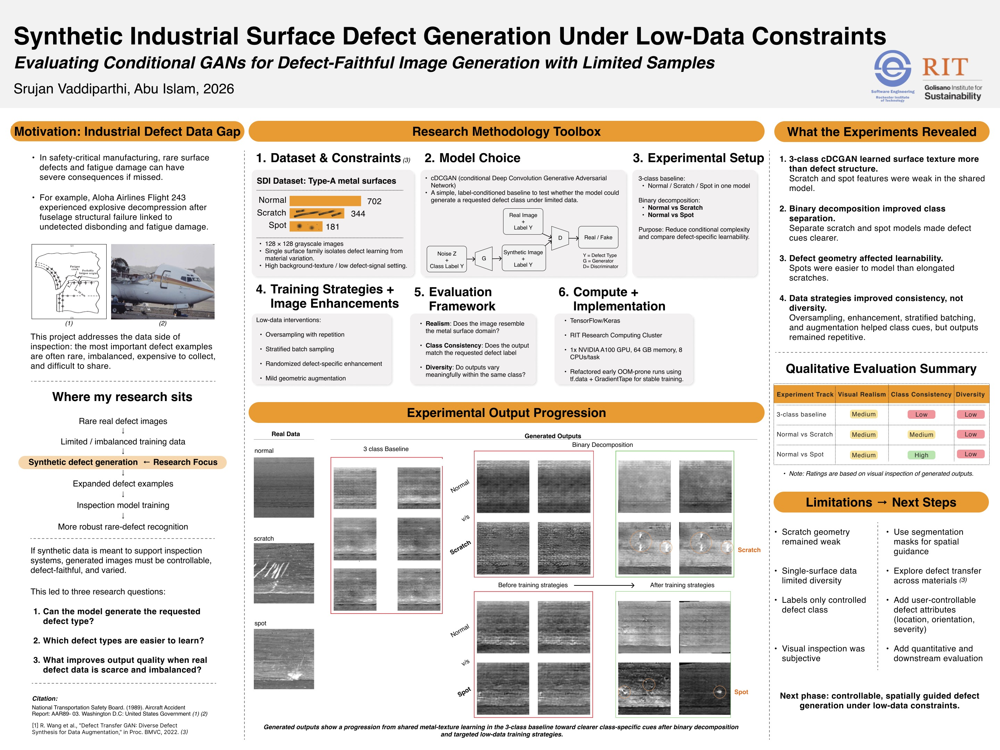

# Generative AI for Sustainability - Research Project

  
   
  <em>Figure 1: Overview of the GAN architecture for sustainability applications</em>

 
## Overview
This project explores the application of Generative Adversarial Networks (GANs) in computer vision for sustainability-related tasks such as object detection and anomaly detection.

## Project Structure
- **data/**: Contains datasets used for training models.
- **notebooks/**: Jupyter notebooks for running experiments.
- **src/**: Source code for model training and testing.
- **reports/**: Literature reviews and progress reports.
- **results/**: Model output and analysis.

## Current Status
- Started with literature review on GAN-based object detection.
- Initial experiments for object detection using GANs.

## Next Steps
- Implement GAN for synthetic data generation.
- Evaluate model performance on real-world sustainability datasets.

